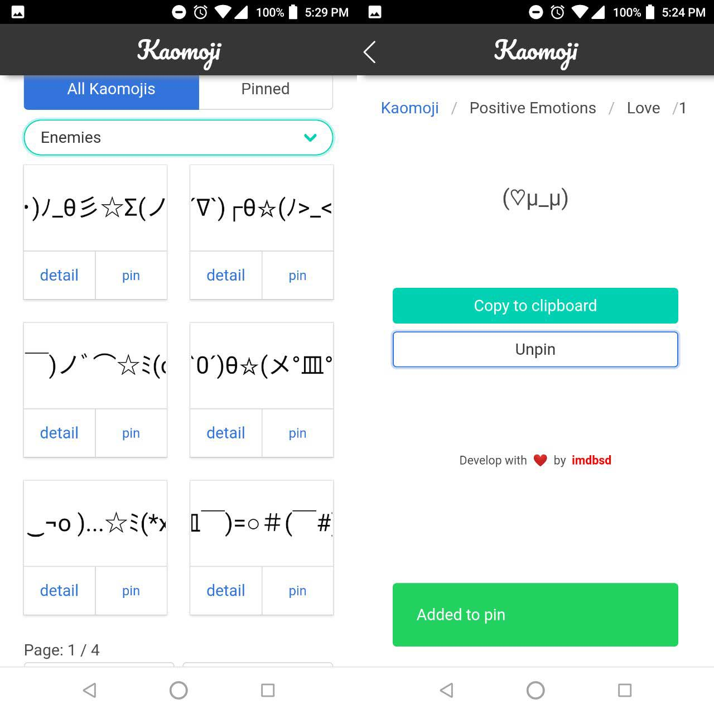

# KAOMOJI []

> Kaomoji (顔文字) is a popular Japanese emoticon style made up of Japanese characters and grammar punctuations, and are used to express emotion in texting and cyber communication. The word kaomoji is also synonymous to be referred to as Japanese emoticons. This concept is formed by the combination of two words in Kanji, “kao” (顔 – “face”) and “moji” (文字 – “character”).

Source. [kaomoji.ru](http://kaomoji.ru/en)

# Stack

1. React
2. Create React App
3. React Router Dom
4. Styled Components
5. Bulma

# Contributing

Having an unlisted kaomoji? Please create an issue or a PR for improvement.

# Credits
1. Kaomoji init emoji content from [kaomoji.ru](http://kaomoji.ru/en)
2. Icons made by [Lucy G](https://www.flaticon.com/authors/lucy-g) from [www.flaticon.com](https://www.flaticon.com/) is licensed by CC 3.0 BY
